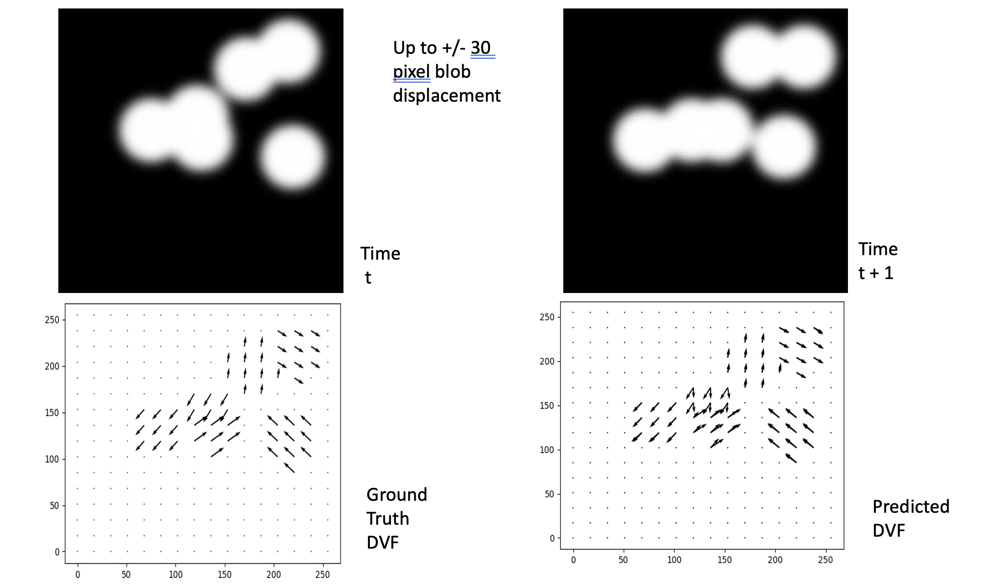

# ToyRegistration

## Running GenerateSamples

Install dependencies with pip

`pip install -r requirements.txt`

Test it out - will create a directory `output-images/` and write images there

`python main.py`

## What you can do

Register two images with U-Net and output the displacement vector field

  
 
